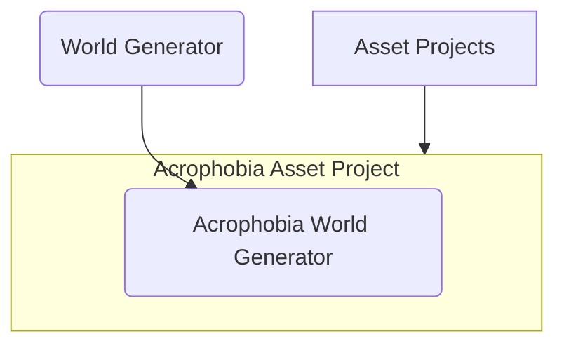

# World Generator
<div align="center">

  <br/>
  <span style="font-size: 0.9em; color: gray;">A world generated with something like "Generate me a world with a bridge"</span>
</div>

<br>

<div align="center">
  
  <br/>
  <span style="font-size: 0.9em; color: gray;">The array of tools available for the Conductor agent to use, some of which run further agents.</span>
</div>


## Getting started


#### 1. World Generator
Clone this repository (anywhere)

#### 2. Asset Project
So far there is 
- [`acrophobia_v1`](https://github.com/ogoudey/acrophobia_v1), a Unity 6 project that works with Vive Pro 2, and imports ViveInputUtility, a flexible VR package.
- [`acrophobia_u5`](https://github.com/ogoudey/acrophobia_u5), a Unity 2019 project that also works with Vive Pro 2. This project is used for experiments at Tufts, and imports ViveSR, the eye-tracking package. It also has the official menu scripts for running a full experiment from within Unity - no command line needed.
- Coming soon... `acrophobia_v2`, a Unity 6 project that works with [a new headset], and [the eye-tracking packages], [the movement packages]. Will also likely have the experiment menu scripts.

Either clone the asset project into `Acrogen\Resources\Asset Projects\` manually, or use the `install.ps1` (which must be editted to point to the asset project repo).

#### 3. Other tools
For data analysis, you can use [`EyeDataAnalysis`](https://github.com/ogoudey/EyeDataAnalysis). It's not a fully developed UI, but use `python multiplotter.py <path-to-eye-data-for-subj1.csv> <path-to-eye-data-for-subj2.csv>`

## Usage

<div align="center"><em>(These instructions are slightly outdated)</em></div>
<div align="center">
  
  <br/>
  <span style="font-size: 0.9em; color: gray;">Generate — Give a prompt or select from a list of premade prompts, and watch the scene get generated.</span>
</div>

<div align="center">
  
  <br/>
  <span style="font-size: 0.9em; color: gray;">Generations — View past generations and enter them, providing a name of the subject for the trial.</span>
</div>

<div align="center">
  
  <br/>
  <span style="font-size: 0.9em; color: gray;">Settings — Select the Asset Project you want to open (not recommended to change from `acrophobia_v1`).</span>
</div>

## More info

(Lunix install)
```
./install.sh <asset project repo name>
```

## VR Setup 

### VIVE Pro 2
(Assuming a VIVE Pro 2 headset and a wireless adapter, a Windows computer, etc.)
1. Plug the headset into the power brick (make sure the power brick is ON)
2. Open up SteamVR (takes a minute)
3. Open up VIVE Wireless (takes a minute)
4. Import the SteamVR Plugin 2.8.0 (accept all recommended settings)


### Eyedata collection with ViveSR
5. Import the ViveSR package
6. Install the [`acrophobia_u5`](https://github.com/ogoudey/acrophobia_u5) asset project, and open it with a Unity 2019 version.
