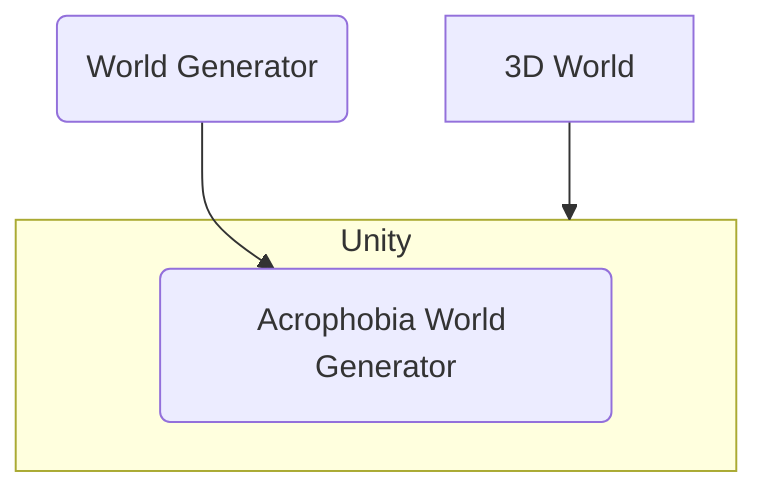

# Acrophobia World Generator

   
  A VR experience generated with something like "Generate me a world with a bridge"

 

```mermaid
graph TD
    A[3D World] --> B[Acrophobia Asset Project]
    C(World Generator) --> D(Acrophobia World Generator)
    subgraph B[Unity]
        D
    end
```

  <a href="instructions.md">See instructions</a>

