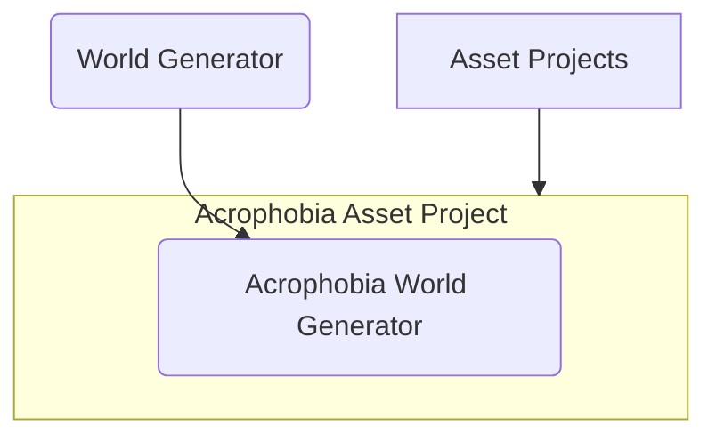

# World Generator

   
  A world generated with something like "Generate me a world with a bridge"

 

  
   
  The array of tools available for the Conductor agent to use, some of which run further agents.

## Getting started

## VR Setup 

### VIVE Pro 2
(Assuming a VIVE Pro 2 headset and a wireless adapter, a Windows computer, etc.)
1. Plug the headset into the power brick (make sure the power brick is ON)
2. Open up SteamVR (takes a minute)
3. Open up VIVE Wireless (takes a minute)
4. Import the SteamVR Plugin 2.8.0 (accept all recommended settings)

### Eyedata collection with ViveSR
5. Import the ViveSR package
6. Install the [`acrophobia_u5`](https://github.com/ogoudey/acrophobia_u5) asset project, and open it with a Unity 2019 version.
