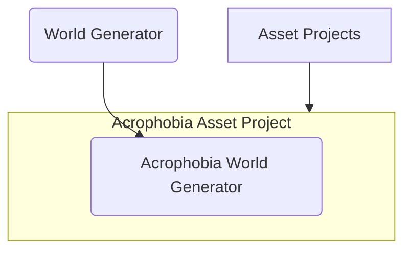

# World Generator

   
  A world generated with something like "Generate me a world with a bridge"

 

  
   
  The array of tools available for the Conductor agent to use, some of which run further agents.

## Getting started

